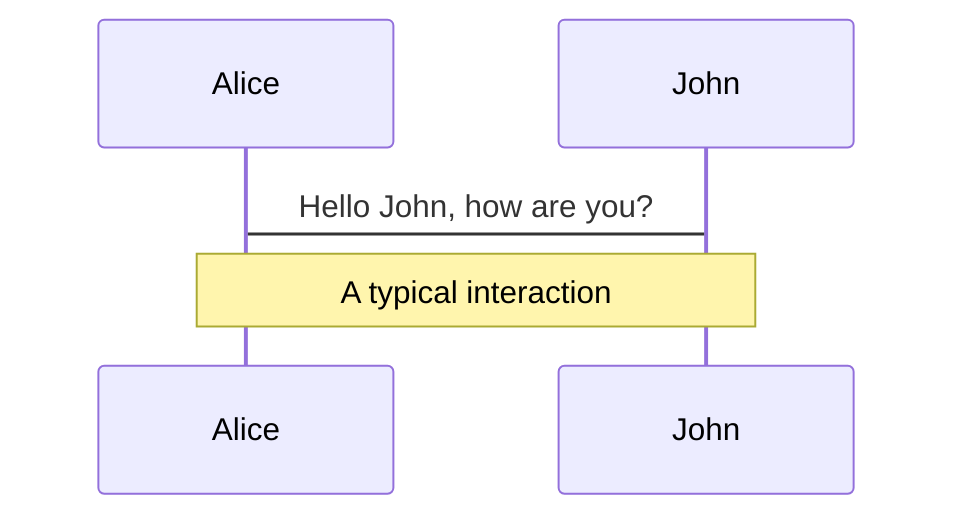
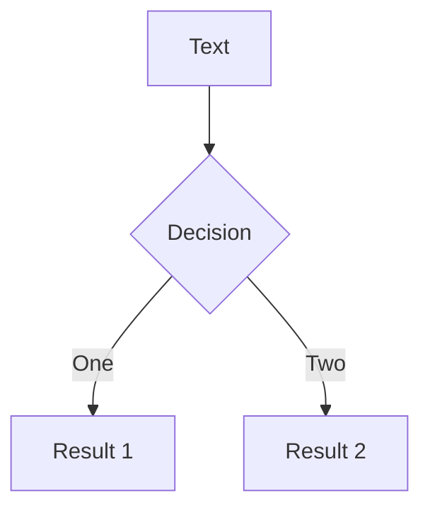
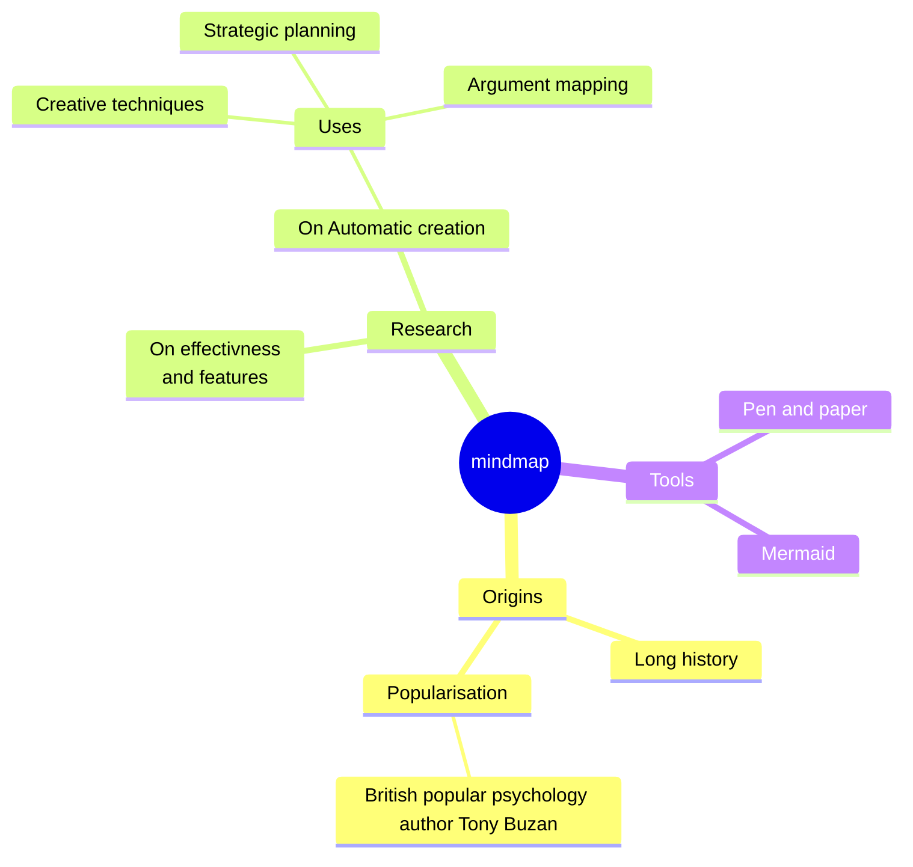
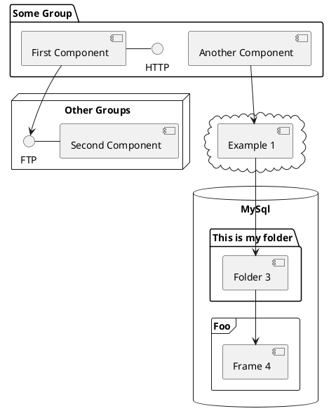

# What your teachers don’t want you to know

My experience with collaboration and tools at Silicon Valley

<div class="abs-br m-6 flex gap-2">
  <a href="https://github.com/interactivelabs/itz-presentation-2023" target="_blank" alt="GitHub"
    class="text-xl slidev-icon-btn opacity-50 !border-none !hover:text-white">
    <carbon-logo-github />
  </a>
</div>

<!--
  WELCOME
-->

---
layout: two-cols-header
transition: fade-out
---

# Who am I?

::left::

## Luis Gonzalez

- <mdi-school-outline class="bg-gradient-to-r from-violet-500 to-sky-500" /> **ITZ Alumni** - Graduated 2004
- <fluent-mdl2-family class="bg-gradient-to-r from-pink-500 to-violet-500" /> **Husband and Father of 2** - Dulce, Robe & Eli
- <material-symbols-videogame-asset-outline class="bg-gradient-to-r from-violet-500 to-red-500" /> **Video game enjoyer** - Obsesced with Hades
- <icon-park-outline-laptop class="bg-gradient-to-r from-blue-500 to-violet-500" /> **Sr. Software Engineer** - Working at Airbnb

::right::

<div class="relative flex justify-center h-96">
  
  
  
  
  
  
</div>

<style>
h1 {
  background-color: #2B90B6;
  background-image: linear-gradient(45deg, #4EC5D4 10%, #146b8c 20%);
  background-size: 100%;
}
</style>

<!--
  INTRO
-->

---
layout: default
---

# Table of contents

<Toc maxDepth="1"></Toc>

---
layout: two-cols-header
transition: slide-up
---

# What do I do?

Why the title of the presentation?

::left::

<v-clicks depth="2">

- Writing code for a living
- Finding Solutions
  - **Learning**
  - **Understanding Code**
    - Read and interpret documentation
  - Debug issues

</v-clicks>

::right::

<div class="relative flex justify-center h-96">
  
  
  
</div>

<!--
  EXPLAIN WHY ME AND WHY I BELIEVE THIS NEEDS TO BE ADDRESSED
-->

---
layout: cover
background: ./images/entrance_2.jpg
---

# **Collaboration** and Tools

---
layout: image-right
image: /images/kitchen_1.jpg
level: 2
---

# Project Management

<!--
  HOW DO WE ORGINIZE
-->

---
layout: image-right
image: /images/kitchen_1.jpg
level: 2
---

# Tools for developing the code

<!--
  CODING
-->

---
layout: image-right
image: /images/kitchen_1.jpg
level: 2
---

# Tools for collaboration on code

<!--
  SHARING THE CODE
-->

---
layout: image-right
image: /images/kitchen_1.jpg
level: 2
---

# Tools for developing the code

<!--
  DEPLOYING
-->

---
layout: image-right
image: /images/kitchen_1.jpg
level: 2
---

# Tools for the code to run (Very Web/Services Focused)

<!--
  CLOUD
-->

---
layout: cover
background: ./images/entrance_3.jpg
level: 2
---

# **THANK YOU**

<!--
  THANK YOU ALL
-->

---
layout: center
class: text-center
---

# Q&A

[LinkedIn <devicon-linkedin />](https://linkedin.com) · [Slides <carbon-logo-github />](https://github.com/interactivelabs/itz-presentation-2023)


---

# Themes

Slidev comes with powerful theming support. Themes can provide styles, layouts, components, or even configurations for tools. Switching between themes by just **one edit** in your frontmatter:

<div grid="~ cols-2 gap-2" m="-t-2">

```yaml
---
theme: default
---
```

```yaml
---
theme: seriph
---
```


</div>

Read more about [How to use a theme](https://sli.dev/themes/use.html) and
check out the [Awesome Themes Gallery](https://sli.dev/themes/gallery.html).

---
preload: false
---

# Animations

Animations are powered by [@vueuse/motion](https://motion.vueuse.org/).

```html
<div
  v-motion
  :initial="{ x: -80 }"
  :enter="{ x: 0 }">
  Slidev
</div>
```

<div class="w-60 relative mt-6">
  <div class="relative w-40 h-40">
    
    
    
  </div>

  <div
    class="text-5xl absolute top-14 left-40 text-[#2B90B6] -z-1"
    v-motion
    :initial="{ x: -80, opacity: 0}"
    :enter="{ x: 0, opacity: 1, transition: { delay: 2000, duration: 1000 } }">
    Slidev
  </div>
</div>

<!-- vue script setup scripts can be directly used in markdown, and will only affects current page -->
<script setup lang="ts">
const final = {
  x: 0,
  y: 0,
  rotate: 0,
  scale: 1,
  transition: {
    type: 'spring',
    damping: 10,
    stiffness: 20,
    mass: 2
  }
}
</script>

<div
  v-motion
  :initial="{ x:35, y: 40, opacity: 0}"
  :enter="{ y: 0, opacity: 1, transition: { delay: 3500 } }">

[Learn More](https://sli.dev/guide/animations.html#motion)

</div>

---

# LaTeX

LaTeX is supported out-of-box powered by [KaTeX](https://katex.org/).

<br>

Inline $\sqrt{3x-1}+(1+x)^2$

Block
$$ {1|3|all}
\begin{array}{c}

\nabla \times \vec{\mathbf{B}} -\, \frac1c\, \frac{\partial\vec{\mathbf{E}}}{\partial t} &
= \frac{4\pi}{c}\vec{\mathbf{j}}    \nabla \cdot \vec{\mathbf{E}} & = 4 \pi \rho \\

\nabla \times \vec{\mathbf{E}}\, +\, \frac1c\, \frac{\partial\vec{\mathbf{B}}}{\partial t} & = \vec{\mathbf{0}} \\

\nabla \cdot \vec{\mathbf{B}} & = 0

\end{array}
$$

<br>

[Learn more](https://sli.dev/guide/syntax#latex)

---

# Diagrams

You can create diagrams / graphs from textual descriptions, directly in your Markdown.

<div class="grid grid-cols-4 gap-5 pt-4 -mb-6">









</div>

[Learn More](https://sli.dev/guide/syntax.html#diagrams)

---
src: ./pages/multiple-entries.md
hide: false
---

---
layout: center
class: text-center
---

# Learn More

[Documentations](https://sli.dev) · [GitHub ](https://github.com/slidevjs/slidev) · [Showcases](https://sli.dev/showcases.html)
